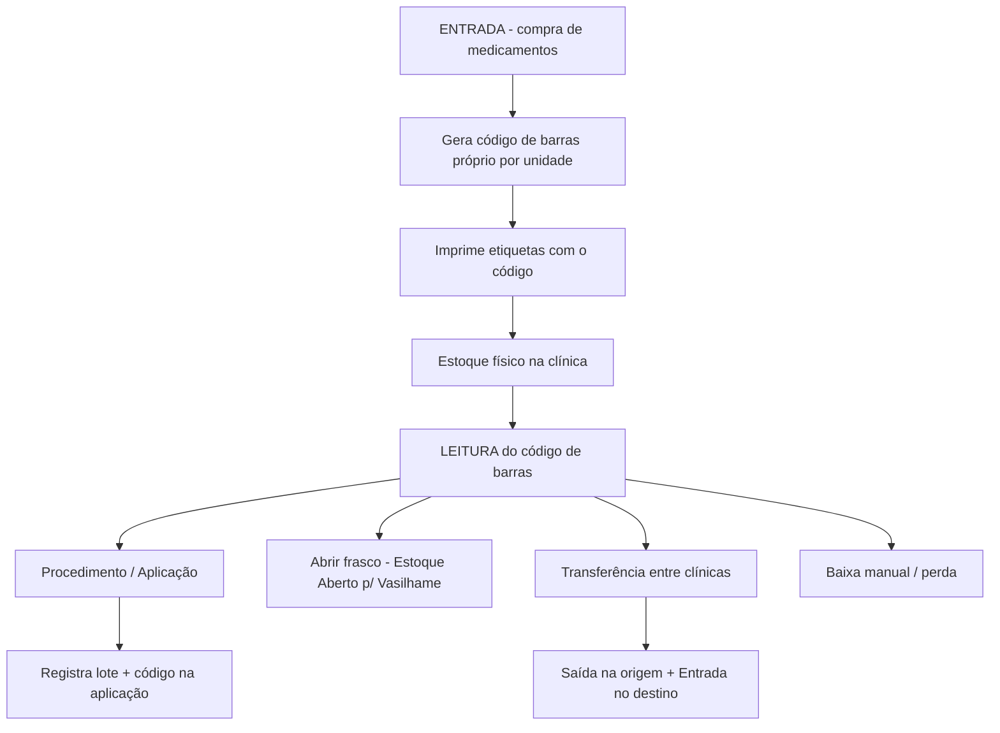

# 03 — Estoque: Entradas, Saídas, Transferências e Baixas (V2)

> **Status:** ✅ **Implementado em 2026-08-12** (migrations, models, importação, controllers, rotas, menu e telas concluídos)
> **Data:** 2026-08-12
> **Objetivo:** Analisar como a **V1** controla o estoque (entradas, saídas, transferências, baixas, código de barras próprio, estoques abertos) e propor melhorias/redesenho para a **V2**.

> **Nota de implementação (2026-08-12):** implementados os módulos de **Estoque (saldo com alertas)**, **Entradas** (com geração de código de barras e etiquetas), **Baixas**, **Transferências**, **Ajustes de Estoque** (admin) e o **Extrato por medicamento/código de barras**. Dados da V1 importados (10 fornecedores, 450 entradas, 381 baixas, 265 transferências, 46.357 movimentos, 473 saldos, 937 frascos abertos, 151 baixas de abertos, 56 contadores de código). `aplicacao_lotes` adiado (depende do módulo de procedimentos). Saldo persistido em `estoques_saldos` atualizado na mesma transação (`Estoque::registrar`/`Estoque::remover`).

---

## 1. Contexto

Na V1 o controle de estoque gira em torno de **um código de barras próprio**: quando o sistema compra um medicamento (entrada), ele gera um código de barras interno por unidade; é esse código que é **lido/escaneado** depois para abrir frascos, aplicar em procedimentos, baixar, transferir entre clínicas etc. Praticamente **tudo que mexe no estoque passa pelo `codigo_barras`**.

Este relatório mapeia o funcionamento atual da V1 e lista sugestões para a V2 **melhorar** (sem necessariamente repetir os problemas da V1).

---

## 2. Como funciona na V1

### 2.1 Fluxo macro



### 2.2 Tabelas (schema da V1)

| Tabela | Colunas principais | Papel |
|---|---|---|
| `entradas` | `clinica_id`, `fornecedor_id`, `nota`, `data`, `valor`, `arquivo` | Compra/recebimento (cabeçalho). `arquivo` = imagem da NF. |
| `baixas` | `clinica_id`, `motivo`, `data`, `valor` (+ `user_id`) | Cabeçalho de baixa (fechado). |
| `transferencias` | `clinica_id` (origem), `clinica_destino_id`, `motivo`, `data`, `valor` (+ `user_id`, `administrador_id`) | Cabeçalho de transferência. |
| `estoques` | `clinica_id`, `entrada_id`/`baixa_id`/`transferencia_id`/`procedimento_id`, `medicamento_id`, `origem`, `tipo` (`Entrada`/`Saida`), `quantidade`, `valor`, `total`, `lote`, `dt_vencimento`, `codigo_barras` | **Livro de movimentos** — cada linha é um movimento que aumenta ou diminui o saldo. |
| `estoque_abertos` | `medicamento_id`, `procedimento_id`, `user_id`, `clinica_id`, `identificador`, `dt_cadastro`, `qt_inical`, `qt_utilizado`, `qt_restante`, `lote`, `codigo_barras`, `situacao` (`Aberto`/`Finalizado`) | "Frasco aberto" — controle do vasilhame em mg (quanto foi usado/resta). |
| `baixa_abertos` | `clinica_id`, `estoque_aberto_id`, `user_id`, `quantidade`, `motivo` | Baixa sobre frasco aberto. |
| `aplicacao_lotes` | `aplicacao_id`, `quantidade`, `lote`, `codigo_barras`, `estoque_aberto_id` | Lotes/códigos usados em cada aplicação. |
| `codigo_barra_medicamentos` | `medicamento_id`, `contador` | Contador sequencial por medicamento (gera o código). |
| `fornecedors` | `id`, `nome` | Fornecedores. |

### 2.3 O código de barras (coração do sistema)

- **Formato**: `medicamento_id` (com 2 dígitos, `09`) + `contador` (com 5 dígitos, `00869`) → **`0900869`**.
- O contador vem da tabela `codigo_barra_medicamentos` (incrementa a cada geração por medicamento).
- Exemplos reais encontrados na V1: `1500037`, `1500039` (med 15), `4500924` (med 45), `0900869` (med 9).
- Gerado na **entrada**, campo "C. Barras" com botão de gerar (`gerar_codigo_barras`).
- Etiquetas impressas com a lib **Picqer Barcode Generator** (CODE_128), layout de 30mm×15mm (3 por linha).
- **Leitura** feita por leitor de código de barras (campo de input com foco), que chama endpoints Ajax:
  - `busca_lote_por_codigo` — valida lote, **bloqueia vencido**, confere saldo.
  - `busca_lote_por_codigo_frasco` — valida frasco aberto (vasilhame) e quantidade restante.
- **O mesmo código acompanha o item** em transferências (entra na outra clínica com o mesmo código) e em aplicações (registrado em `aplicacao_lotes`).

### 2.4 Fluxo detalhado

**Entrada (compra):**
1. Seleciona fornecedor, data, nº da nota, arquivo da NF.
2. Adiciona medicamentos (linhas dinâmicas): medicamento, quantidade, valor unitário, total, **lote**, **vencimento**, **código de barras** (gerado por botão).
3. Grava `entradas` (cabeçalho) + 1 linha em `estoques` (tipo=Entrada) por medicamento/lote.
4. Atualiza `medicamentos.ultimo_valor_pg` com o último valor pago.
5. Imprime etiquetas de código de barras (1 por unidade).

**Estoque aberto (Vasilhame — ex.: Mounjaro 90mg):**
- `abrir_frasco`: registra `estoque_abertos` com `qt_inical = vasilhame` (90), `qt_utilizado = 0`, `qt_restante = 90`, `situacao = Aberto`, e lança um movimento `estoques` (tipo=Saida, qtd=1) na origem "Procedimento".

**Aplicação (saída por procedimento):**
- Na aplicação, o enfermeiro informa o lote/código lido; o sistema valida vencimento e saldo; grava `aplicacao_lotes` e lança `estoques` (tipo=Saida, origem=Procedimento). Para vasilhame, consome do `estoque_abertos` (incrementa `qt_utilizado`, decrementa `qt_restante`, finaliza quando `<= 0`).

**Baixa manual:**
- `baixas` (fechado): motivos como vencido/danificado/perda; lança `estoques` (tipo=Saida, origem=Baixa) por medicamento/lote.
- `baixa_abertos` (aberto): baixa sobre frasco aberto (decrementa o restante).

**Transferência:**
- Origem e destino (clínicas); por cada item lança **2 movimentos**: `estoques` tipo=Saida na origem **e** tipo=Entrada no destino, com o mesmo lote/código.
- Ao final permite **imprimir etiquetas** para o destino.

**Visão administrativa / relatórios:**
- `EstoqueAdmController::index`: tabela de saldo por medicamento × clínica (soma entradas−saídas por clínica) + lista de frascos abertos.
- Relatórios: `relatorios/estoque`, `relatorios/baixas`, `relatorios/transferencias` (com filtros e **exportação Excel** via PhpSpreadsheet).
- Dashboard: lista de vencimentos ≤ 90 dias (`get_medicamentos_vencimento`).

### 2.5 Dados atuais da V1 (produção)

| Tabela | Registros |
|---|---|
| `estoques` | **46.357** movimentos (3.503 Entrada / 42.854 Saida) |
| `estoque_abertos` | 937 (12 Aberto / 925 Finalizado) |
| `aplicacao_lotes` | 54.810 |
| `entradas` | 450 |
| `baixas` | 381 |
| `transferencias` | 265 |
| `baixa_abertos` | 151 |
| `codigo_barra_medicamentos` | 57 |
| `fornecedors` | 10 |

Movimentos por origem: `Procedimento` 40.157, `Baixa` 1.561, `Entrada` 2.209, `Transferencia` 2.256, `Ajuste de Estoque*` 174 (vários tipos de ajuste manual).

> **\*** Existência de origens "Ajuste de Estoque", "Ajuste de Estoque Negativo", "Ajuste de Estoque Negativo Barcode", "Ajuste de Inventário", "Estorno de Ajuste" indica que **correções foram feitas via scripts avulsos** (scratch), não por uma tela de ajuste — sinal de fragilidade.

---

## 3. Pontos fracos / problemas identificados na V1

1. **Saldo calculado na hora (performance)**: todo saldo é `SUM(Entrada) − SUM(Saida)` sobre as 46k+ linhas, repetido várias vezes por página (várias queries por medicamento → **N+1**). Vai piorar com o tempo.
2. **Sem saldo persistido**: não há uma tabela de "saldo por código/clínica" — tudo derivado; qualquer divergência exige recálculo manual.
3. **Código de barras sem dígito verificador**: um erro de leitura pode "casar" com outro código válido de outro item. Prefixo do medicamento limitado a 2 dígitos (até 99 medicamentos).
4. **Baixa/editar entrada destrutivas**: editar/excluir entrada **deleta** as linhas de `estoques` sem audit trail (se já houve saída do lote, o saldo muda retroativamente).
5. **Baixa e transferência sem validação de saldo suficiente** (aplicação valida, mas baixa/transferência não).
6. **Transferência "às cegas"**: grava saída na origem e entrada no destino **na hora**, sem confirmação de recebimento — divergência se o destino não receber.
7. **Campo `identificador` = `'xx'`** fixo (lixo) e typo **`qt_inical`** (deveria ser `qt_inicial`).
8. **Histórico de preço perdido**: `ultimo_valor_pg` é sobrescrito a cada entrada.
9. **Baixa de "fechados" sem tela de edição** (`editar()` com `die()` descontinuado).
10. **Estoque aberto sem vínculo forte com o código** (o movimento de "abertura" sai `qtd=1` de um vasilhame de 90mg — conceitualmente estranho).
11. **Sem tela de ajuste de estoque / inventário** (só scripts avulsos).
12. **Sem auditoria completa**: nem todo movimento guarda `user_id`; origem livre (string) permite inconsistências.
13. **Alertas de vencimento e de estoque mínimo/médio** existem no cálculo (vencimento) mas **não há alerta visual ativo** no estoque (o `estoque_minimo`/`estoque_medio` nem eram usados na V1).

---

## 4. Proposta V2 — Schema

Seguindo o padrão da V2 (relatório 01): `id_versao1` em todas as tabelas migradas 1:1; preservar ids das tabelas que têm FK entre si (medicamentos, clínicas, fornecedores). **Sugestão de schema melhorado** (nomes corrigidos, saldo persistido, auditoria):

```php
// fornecedors (1:1 V1 -> id_versao1)
Schema::create('fornecedores', function (Blueprint $table) {
    $table->id();
    $table->unsignedBigInteger('id_versao1')->nullable()->index();
    $table->string('nome');
    $table->timestamps();
});

// entradas (1:1 V1)
Schema::create('entradas', function (Blueprint $table) {
    $table->id();
    $table->unsignedBigInteger('id_versao1')->nullable()->index();
    $table->unsignedBigInteger('clinica_id');
    $table->unsignedBigInteger('fornecedor_id');
    $table->string('nota')->nullable();
    $table->date('data');
    $table->double('valor');
    $table->string('arquivo')->nullable();
    $table->timestamps();
    // FKs p/ clinicas e fornecedores
});

// baixas (1:1 V1) + motivo enum
Schema::create('baixas', function (Blueprint $table) {
    $table->id();
    $table->unsignedBigInteger('id_versao1')->nullable()->index();
    $table->unsignedBigInteger('clinica_id');
    $table->unsignedBigInteger('user_id')->nullable();
    $table->string('motivo');
    $table->date('data');
    $table->double('valor');
    $table->timestamps();
});

// transferencias (1:1 V1)
Schema::create('transferencias', function (Blueprint $table) {
    $table->id();
    $table->unsignedBigInteger('id_versao1')->nullable()->index();
    $table->unsignedBigInteger('clinica_id');        // origem
    $table->unsignedBigInteger('clinica_destino_id'); // destino
    $table->unsignedBigInteger('user_id')->nullable();
    $table->unsignedBigInteger('administrador_id')->nullable();
    $table->string('status')->default('enviada');     // enviada | recebida | cancelada
    $table->string('motivo');
    $table->date('data');
    $table->double('valor');
    $table->timestamps();
});

// estoques -> MOVIMENTOS (1:1 V1)  [nome mantido: estoques]
Schema::create('estoques', function (Blueprint $table) {
    $table->id();
    $table->unsignedBigInteger('id_versao1')->nullable()->index();
    $table->unsignedBigInteger('clinica_id');
    $table->unsignedBigInteger('entrada_id')->nullable();
    $table->unsignedBigInteger('baixa_id')->nullable();
    $table->unsignedBigInteger('transferencia_id')->nullable();
    $table->unsignedBigInteger('procedimento_id')->nullable();
    $table->unsignedBigInteger('medicamento_id')->nullable();
    $table->unsignedBigInteger('user_id')->nullable();        // auditoria
    $table->string('origem');                                   // Entrada|Baixa|Transferencia|Procedimento|Ajuste|Estorno
    $table->enum('tipo', ['Entrada', 'Saida'])->default('Entrada');
    $table->double('quantidade');
    $table->double('valor', 10, 2);
    $table->double('total', 10, 2);
    $table->string('lote');
    $table->date('dt_vencimento');
    $table->string('codigo_barras')->nullable();
    $table->timestamps();
    // índices compostos: (clinica_id, codigo_barras), (medicamento_id, lote)
});

// estoques_saldos -> SALDO PERSISTIDO por código + lote + clínica (NOVO na V2)
Schema::create('estoques_saldos', function (Blueprint $table) {
    $table->id();
    $table->unsignedBigInteger('clinica_id');
    $table->unsignedBigInteger('medicamento_id');
    $table->string('lote');
    $table->string('codigo_barras')->nullable();
    $table->date('dt_vencimento')->nullable();
    $table->double('saldo')->default(0);        // atualizado a cada movimento
    $table->timestamps();
    // unique: (clinica_id, medicamento_id, lote, codigo_barras)
});

// estoque_abertos (1:1 V1) com nomes corrigidos
Schema::create('estoque_abertos', function (Blueprint $table) {
    $table->id();
    $table->unsignedBigInteger('id_versao1')->nullable()->index();
    $table->unsignedBigInteger('medicamento_id');
    $table->unsignedBigInteger('procedimento_id')->nullable();
    $table->unsignedBigInteger('user_id');
    $table->unsignedBigInteger('clinica_id');
    $table->date('dt_cadastro');
    $table->double('qt_inicial');               // corrigido (era qt_inical)
    $table->double('qt_utilizado');
    $table->double('qt_restante');
    $table->string('lote');
    $table->string('codigo_barras')->nullable();
    $table->enum('situacao', ['Aberto', 'Finalizado'])->default('Aberto');
    $table->timestamps();
});

// baixa_abertos (1:1 V1) — igual à V1, com user_id
// aplicacao_lotes (1:1 V1) — igual à V1
// codigo_barra_medicamentos (1:1 V1) — contador por medicamento
```

> **Decisão (2026-08-12)**: manter a nomenclatura **`estoques`** (como a V1) e criar a nova tabela **`estoques_saldos`** para o saldo persistido.

---

## 5. Sugestões de melhoria para a V2 (priorizadas)

### A. Fundação / dados (fazer primeiro)

1. **Saldo persistido (`estoque_saldos`)** — atualizar dentro da **mesma transação** do movimento. Acaba com o N+1 e permite telas rápidas. Recálculo inicial a partir da V1 (script idempotente como os demais `migracao/*.php`).
2. **Auditoria completa** — `user_id` em todo movimento (entrada, saída, baixa, transferência, ajuste, estorno).
3. **Transações atômicas** — entrada, baixa, transferência e ajuste dentro de `DB::transaction()`; nunca "deletar para regravar" sem rastro. Criar **estorno** (movimento inverso com referência ao movimento original) em vez de `DELETE`.
4. **Corrigir schema**: renomear `identificador` fora (remover), corrigir `qt_inical` → `qt_inicial`, e usar `enum` para `tipo`/`situacao`/`origem`.

### B. Código de barras (núcleo)

5. **Formato do código revisado**: manter o padrão existente (compatibilidade com etiquetas já impressas), mas:
   - **Adicionar dígito verificador (módulo 10/11)** para evitar leitura trocada;
   - Aumentar o padding do medicamento (ex.: 3 dígitos) e do contador (ex.: 6) para escalar;
   - Guardar o `codigo_barras` como **identidade do item físico** (1 código = 1 unidade; em lote, registrar `dt_vencimento` por código).
6. **Etiquetas**: gerar por item de entrada com botão "imprimir tudo", mantendo Picqer (já no `composer.json` da V1) — em PDF mais limpo (A4 com folhas de etiquetas).
7. **Leitura com UX**: campo de scan com autofocus + som/visual de "código lido", e **leitura em lote** (encadear scans) para baixas/transferências.

### C. Operação

8. ~~**Transferência com confirmação**~~ → **Decisão (2026-08-12): manter a dupla gravação imediata** (saída na origem + entrada no destino na hora), como a V1 — o usuário dispensou a “burocracia” de confirmação.
9. **Validação de saldo em baixa e transferência** (bloquear quantidade > saldo do código/lote).
10. **Tela de Ajuste/Inventário de estoque** (com motivo e autorização de admin), em vez de scripts avulsos — cobrindo os casos "Ajuste de Estoque Negativo" da V1. **(Decisão 2026-08-12: criar a tela.)**
11. **Alertas ativos**:
    - **Vencimento** (≤ 90, ≤ 30, vencido) — já há o cálculo na V1; na V2 virar **badge/lista no dashboard + filtro**;
    - **Estoque mínimo/médio** — usar os campos que já criamos no `medicamentos` da V2 (`estoque_minimo` = vermelho, `estoque_medio` = amarelo): o saldo do código/lote abaixo do médio acende amarelo; abaixo do mínimo, vermelho.
12. **Dashboard do estoque**: saldo por clínica × medicamento (com os alertas), frascos abertos, últimos movimentos, vencimentos.

### D. Relatórios

13. **Extrato por medicamento e código de barras** (histórico completo de um item: entrada → transferências → aplicações → baixas) — **necessário para o usuário**; hoje não existe na V1. **(Decisão 2026-08-12: implementar a tela de extrato.)**
14. **Relatório de movimentação consolidado** (período, clínica, tipo, origem, usuário) com exportação Excel/PDF (reaproveitar padrão da V1 com PhpSpreadsheet).
15. **Custo/preço**: manter **histórico de preços** (tabela `preco_historicos` ou coluna em movimento) em vez de sobrescrever `ultimo_valor_pg`.

### E. Integração / mobile (futuro)

16. **Leitura via celular**: câmera + QR/CODE_128 (ex.: QuaggaJS/ZXing) para conferência de estoque e recebimento de transferência na clínica destino.

---

## 6. Importação V1 → V2 (padrão da V2)

Scripts em `database/migracao/` (ordem numérica, transação, idempotentes por `id_versao1`):

| Script | O que faz |
|---|---|
| `05_fornecedores.php` | Copia `fornecedors` (preserva ids + `id_versao1`) |
| `06_entradas.php` | Copia `entradas` |
| `07_baixas.php` | Copia `baixas` |
| `08_transferencias.php` | Copia `transferencias` |
| `09_estoques.php` | Copia `estoques` (preserva ids; FKs continuam válidas pois medicamentos/clínicas preservam ids) |
| `10_estoques_saldos.php` | **Recalcula** e popula `estoques_saldos` a partir dos movimentos (saldo por clínica+med+lot+cb) |
| `11_estoque_abertos.php` | Copia `estoque_abertos` (+ corrige `qt_inicial`) |
| `12_baixa_abertos.php` | Copia `baixa_abertos` |
| `13_aplicacao_lotes.php` | Copia `aplicacao_lotes` |
| `14_codigo_barra.php` | Copia `codigo_barra_medicamentos` |

> ⚠️ **Atenção (bug conhecido da importação)**: nos scripts de migração, não reutilizar um mesmo query builder para o `where(...)->exists()` em loop — o `where()` **acumula** condições e quebra a idempotência a partir do 2º registro. Usar `DB::table(...)` novo a cada iteração (padrão já corrigido nos scripts 00–04).

---

## 7. Decisões tomadas (2026-08-12)

| # | Decisão | Resposta do usuário |
|---|---|---|
| 1 | Nomenclatura da tabela de movimentos | Manter **`estoques`** (como a V1) |
| 2 | Saldo persistido | **Sim**, criar a tabela **`estoques_saldos`** |
| 3 | Código de barras | Manter o **formato atual** (sem dígito verificador) — funciona como está |
| 4 | Transferência | Manter **dupla gravação imediata** (origem + destino na hora) |
| 5 | Escopo | **Ir direto em tudo** — montar todas as telas, **inclusive o extrato por medicamento e código de barras** |
| 6 | Ajuste de estoque | **Sim**, criar a tela de ajustes |

---

## 8. Resumo

- A V1 usa um **livro de movimentos** (`estoques`, 46k linhas) + **código de barras próprio** (medicamento+contador) que controla tudo: entrada, leitura, abertura de frasco, aplicação, baixa e transferência.
- Os pontos fortes (código de barras único por item, rastreio por lote/vencimento, etiquetas, relatórios Excel) devem ser **preservados** na V2.
- Os pontos fracos (saldo calculado na hora, sem estorno/auditoria, transferência sem confirmação, sem tela de ajuste, sem alertas ativos) são as **oportunidades de melhoria**.
- A V2 deve nascer com: **saldo persistido**, **transações atômicas + estorno**, **auditoria por usuário**, **transferência com confirmação**, **tela de ajuste**, **alertas de vencimento e de estoque mínimo/médio** (aproveitando os campos já criados em `medicamentos`), e **importação idempotente** dos dados da V1.
