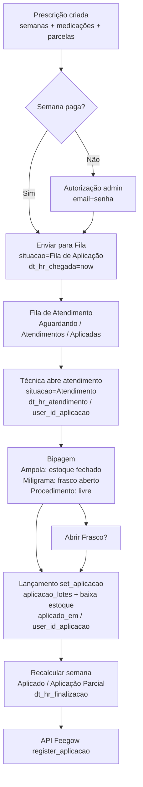

# 06 — Fila de Atendimento + Bipagem + Lançamento da Aplicação (V2)

> **Status:** 📋 PROPOSTA para aprovação (2026-08-14)
> **Data:** 2026-08-14
> **Objetivo:** Implementar na V2 o fluxo operacional da enfermagem: **enviar a semana para a Fila de Atendimento → atendimento pela técnica → bipagem dos códigos de barras (leitor/manual) → lançamento dos dados (aplicação + baixa de estoque)**. Este relatório descreve **como a V1 funciona hoje** (fonte da verdade) e propõe **como portar/redesenhar na V2** sobre o modelo novo de `prescricaos` / `prescricao_semanas` / `prescricao_semana_medicamentos`.
>
> **Base:** análise dos controllers `DashboardSistemaController`, `ProcedimentoSistemaController`, views `fila_atendimento.blade.php`, `enfermeira_acessar_procedimento_new.blade.php`, partial `inc/linha_aplicacao.blade.php` e models `Aplicacao`, `Estoque`, `EstoqueAberto` da V1 (`instituto_gl`).

---

## 0. Resumo executivo (o que será implementado)

1. **Enviar semana para a Fila**: a semana entra com `situacao = 'Fila de Aplicação'` e grava `dt_hr_chegada`. Fluxo **com pagamento** (livre) e **sem pagamento** (exige autorização de um administrador — e-mail + senha).
2. **Tela de Fila de Atendimento**: 3 blocos — **Aguardando**, **Atendimentos**, **Aplicadas** (do dia) + **Resumo de Atendimentos do Dia** por enfermeira.
3. **Abrir procedimento**: a técnica "pega" o paciente → `situacao = 'Atendimento'`, grava `dt_hr_atendimento` e `user_id_aplicacao` (quem está atendendo).
4. **Bipagem de código de barras**: para cada medicação da semana, campo de código de barras (leitor com Enter = blur, ou digitação manual) que consulta o lote/saldo em tempo real via AJAX. Regras por unidade: **Ampola** (valida no estoque fechado + vencimento + saldo), **Miligrama** (valida no **frasco aberto** `estoque_abertos`, suporta "aplicação com 2 códigos"), **Procedimento** (código livre, sem lote). Botão **"Abrir Frasco"** para abrir um frasco de Miligrama.
5. **Lançamento dos dados**: `set_aplicacao` marca cada medicação como **Aplicada**, registra `aplicacao_lotes` (lote + código + frasco aberto), **dá baixa no estoque** e finaliza a semana (`Aplicado` / `Aplicação Parcial`, `dt_hr_finalizacao`), com **confirmação visual** antes de salvar e integração com a API Feegow (`register_aplicacao`).
6. **Na V2** tudo isso roda sobre `prescricao_semanas` / `prescricao_semana_medicamentos` (com `dt_hr_chegada`, `dt_hr_atendimento`, `aplicado_em`, `user_id_aplicacao` por item) — **ainda não existe** na V2 (só o modelo de dados e o financeiro).
7. **Navegação (decisão do usuário)**: todo o módulo fica sob um **menu "Enfermagem" ao lado do Dashboard** — fila de espera, atendimentos do dia e tudo mais ficam **dentro** desse menu (não como um item "Fila de Atendimento" solto).

---

## 1. Contexto e objetivos

- O negócio central do Instituto GL é o ciclo: **prescrição médica → semanas → Fila de Atendimento → aplicação pela enfermagem (bipagem) → baixa de estoque → pagamento**.
- Na V1 esse fluxo já existe e funciona em produção, mas está todo na lógica de **controllers gigantes** e na tabela `procedimentos` (1 linha por semana) com `aplicacaos` (1 linha por medicação).
- A V2 já tem a base de dados nova (`prescricaos`, `prescricao_semanas`, `prescricao_semana_medicamentos`, `aplicacao_lotes`, `estoque_abertos`, financeiro por parcela), mas **a parte operacional da enfermagem (fila + bipagem + lançamento) ainda não foi construída**.
- Este relatório serve de guia para **implementar essa etapa na V2**, aproveitando o que a V1 já resolveu (regras de negócio, validações, telas) e corrigindo os pontos fracos.

---

## 2. Análise da V1 (como funciona hoje)

### 2.1 Estrutura (tabelas envolvidas)

| Tabela V1 | Papel no fluxo |
|---|---|
| `procedimentos` | **1 linha por semana**. Campos do fluxo: `clinica_id_aplicacao` (clínica onde será aplicado), `situacao` (Fila de Aplicação / Atendimento / Aplicado / Aplicação Parcial / Pendente / Agendado / Semana Sem Aplicação), `data_aplicacao`, `dt_hr_chegada`, `dt_hr_atendimento`, `dt_hr_finalizacao`, `user_id_aplicacao` (enfermeira), `st_pagamento` / `valor` / `autorizador_sem_pagamento` (gate de liberação), `st_biopedancia` / `st_coleta` / `obs_biopedancia` / `tp_coleta` / `obs_coleta` (exames opcionais), `st_retirada` / `obs_retirada`, `consulta_tratamento_agendada` |
| `aplicacaos` | **1 linha por medicação da semana**. `procedimento_id`, `medicamento_id`, `quantidade`, `valor`, `total`, `situacao` (Aberta/Aplicada/Pendente/Cancelada), `obs`, `is_soro`, `dt_hr_chegada`, `dt_hr_atendimento`, `user_id_aplicacao` |
| `aplicacao_lotes` | **lote/código usado em cada aplicação** (pode ter 2 = "2 códigos"). `aplicacao_id`, `quantidade`, `lote`, `codigo_barras`, `estoque_aberto_id`, `created_at` (usado como data da aplicação no relatório) |
| `estoque_abertos` | **frasco aberto** (Miligrama). `medicamento_id`, `procedimento_id`, `clinica_id`, `user_id`, `qt_inical` (= `vasilhame`), `qt_utilizado`, `qt_restante`, `lote`, `codigo_barras`, `situacao` (Aberto/Finalizado) |
| `estoques` | **movimentações** (Entrada/Saida) por lote/código. Saldo = Σ Entrada − Σ Saida (`tipo`, `origem`, `quantidade`, `lote`, `codigo_barras`, `dt_vencimento`) |
| `medicamentos` | `unidade` (Ampola/Miligrama/Procedimento), `aplicacao` (Sim/Não), `vasilhame` (capacidade do frasco), `grupo_id` (busca de frasco aberto por grupo) |
| `administradores` | autorizador para liberar aplicação **sem pagamento** |
| `users` / `clinicas` | enfermeira (`user_id_aplicacao`) e clínica de aplicação (`clinica_id_aplicacao`) |

### 2.2 Enviar a semana para a Fila de Atendimento

- **`enviar_fila_aplicacao`** (POST `/sistema/procedimentos/enviar_fila_aplicacao`):
  1. Grava `clinica_id_aplicacao = user->clinica_id`, `situacao = 'Fila de Aplicação'`, `data_aplicacao = hoje`.
  2. Copia flags de exames: `st_biopedancia`, `st_coleta` (exames), `st_retirada` / `obs_retirada`, `consulta_tratamento_agendada`.
  3. Grava **`dt_hr_chegada = now()`** (o horário de "chegada" na fila é o momento do envio).
  4. Redireciona conforme origem (`retorno`: `sistema_dashboard` / `adm_dashboard` / listagem).
- **`enviar_fila_aplicacao_sem_pagamento`** (POST `/sistema/procedimentos/enviar_fila_aplicacao_sem_pagamento`): mesmo efeito, porém **exige autorização**:
  1. Valida `email` + `senha` contra `administradores` ativos (`Hash::check`).
  2. Grava `autorizador_sem_pagamento = autorizador->id` (rastreio de quem liberou).

> **Gate de liberação** (também validado ao abrir o atendimento): `st_pagamento != 'Sim' && !autorizador_sem_pagamento && valor > 0` → bloqueia.

### 2.3 Tela da Fila de Atendimento

- **`fila_atendimento`** (ANY `/sistema/fila_atendimento`) lista para a clínica da usuária (`clinica_id_aplicacao`), ordenado por `updated_at`:
  - **Aguardando** (`situacao = 'Fila de Aplicação'`)
  - **Atendimentos** (`situacao = 'Atendimento'`)
  - **Aplicadas** (`situacao = 'Aplicado'` e `data_aplicacao = hoje`)
- Colunas: Chegada (`updated_at` formatado), Paciente (com botão de observações), Procedimentos (Aplicação / Biopedância / Coleta), Médico, Situação (badge).
- **Filtro de exibição**: a semana só aparece na fila se tiver ≥1 medicação com `aplicacao == 'Sim'` **ou** tiver `st_biopedancia == 'Sim'` **ou** `st_coleta == 'Sim'` (semanas de pausa/valores não aparecem).
- **Resumo de Atendimentos do Dia**: tabela por enfermeira com Qtd. Pacientes / Qtd. Aplicação / Qtd. Bio / Qtd. Coleta + TOTAL GERAL (desconsidera `tipo_atendimento` contendo "Consulta"/"Retorno").
- Nas **Aplicadas**, se `user_id_aplicacao == user->id`, aparece menu "Abrir Atendimento" (para editar/reabrir).

### 2.4 Abrir o procedimento (início do atendimento)

- **`enfermagem_acessar_procedimento($id)`** (GET `/sistema/dashboard/enfermagem_acessar_procedimento/{id}`):
  1. **Gate de pagamento**: se não pago e sem autorizador e valor > 0 → bloqueia ("não está pago para fazer a aplicação").
  2. Se `Aplicado`/`Finalizado` → redireciona para **visualizar** (sem alterar nada).
  3. Se `situacao` **não** for `Fila de Aplicação`/`Aplicação Parcial` **e** não é a própria enfermeira (`user_id_aplicacao != user->id`) → bloqueia ("já está sendo atendido").
  4. **Grava**: `situacao = 'Atendimento'`, `dt_hr_atendimento = now()`, `user_id_aplicacao = user->id`.
- Existem **2 views**: `enfermeira_acessar_procedimento` (antiga) e `enfermeira_acessar_procedimento_new` (novo fluxo de bipagem — a usada hoje). O modo `?controle=...` alterna.
- **Manter sessão viva**: página de aplicação chama `/dashboard/keep-alive` via AJAX a cada 10 min para não expirar a sessão/CSRF enquanto a página fica muito tempo aberta.

### 2.5 Bipagem de códigos de barras (tela)

**Estrutura da linha de aplicação** (partial `inc/linha_aplicacao.blade.php`):
| Pendente | Medicamento | Unidade | Quant | Código | Lote | (ações) |

- **Checkbox "Pendente"**: marca a medicação como `Pendente` (não aplicada hoje) — remove os `required` de código/lote.
- Para cada medicação **Aberta/Pendente**, conforme a unidade:
  - **Ampola** → campo `codigo_barras_{id}` (leitor) + campo `lote_{id}` (readonly, preenchido pela consulta).
  - **Miligrama** → campo `codigo_barras_{id}` (leitor) + `lote_{id}` (readonly) + botão **"2 códigos"** (abre modal de aplicação com 2 frascos).
  - **Procedimento** → campo `codigo_barras_{id}` livre (sem lote/consulta).
- Já aplicadas: exibe lote/códigos/vencimento via helpers `lotes()`, `codigos()`, `vencimentos()`.

**Consultas AJAX (bipagem em tempo real):**

| Endpoint | Uso | Validações |
|---|---|---|
| `busca_lote_por_codigo` (Ampola) | onblur do código | Localiza `Estoque` por `codigo_barras + clinica + medicamento`. Bloqueia se **vencido** (`dt_vencimento < hoje`). Verifica **saldo** (`get_saldo_med_cb_clinica` = Σ Entrada − Σ Saida) ≥ quantidade. Preenche o lote. |
| `busca_lote_por_codigo_frasco` (Miligrama) | onblur do código | Localiza **`EstoqueAberto`** (`situacao = 'Aberto'`) por `codigo_barras + clinica` (considera `grupo_id` do medicamento). Verifica **vencimento** do lote original e `qt_restante >= quantidade`. Mensagem "Código de Barras Inválido" / "frasco não possui quantidade necessária, faça o cadastro através da aplicação com 2 códigos". |
| `get_lotes_medicamento_mg` | modal "Abrir Frasco" | Lista códigos de barras de Miligrama com saldo (`get_lotes_medicamento_mg`). |

**Leitor de código de barras:**
- `Enter` em campo `codigo_barras_*` → `preventDefault()` + `blur()` (dispara a consulta; o leitor age como teclado + Enter).
- **Bloqueio de digitação manual inteligente** (bloqueava teclas com intervalo > 50ms e colar) foi **desabilitado em 2026-08-01** porque a leitora quebrou e as enfermeiras passaram a digitar manualmente. → Na V2, **não implementar esse bloqueio** (ou deixá-lo opcional via config).
- `paste/drop` bloqueado (apenas quando o bloqueio estava ativo).

**Abrir Frasco** (`abrir_frasco`, POST `/sistema/dashboard/abrir_frasco`):
- Escolhe medicamento (Miligrama) + código de barras com saldo → cria `EstoqueAberto` (`qt_inical = vasilhame`, `qt_utilizado = 0`, `qt_restante = vasilhame`, `situacao = 'Aberto'`, `procedimento_id`, `user_id`, `clinica_id`) **e** registra uma movimentação de `Saida` (qtd 1, valor 0) no `Estoque` (para o frasco não ser "vendido"/reutilizado como lote fechado).
- Valida vencimento antes de abrir.

**Confirmação antes de salvar:** ao clicar "Registrar Aplicação", monta uma tabela de confirmação (Medicamento / Quantidade / Código / Lote — incluindo o caso de 2 códigos) + lista de anexos/receita, e só então submete o formulário.

### 2.6 Lançamento dos dados (`set_aplicacao`)

**`set_aplicacao`** (POST `/sistema/dashboard/set_aplicacao`) — para cada medicação `Aberta`/`Pendente`:

| Unidade | Passos |
|---|---|
| **Pendente** (checkbox) | `situacao = 'Pendente'`; sinaliza `procedimento_pendente`. |
| **Ampola** | Exige `lote` + `codigo_barras` (senão erro). Verifica vencido. Cria `AplicacaoLote` (quantidade, lote, código). Marca `Aplicada` + `user_id_aplicacao` + `obs`. **Baixa**: cria movimentação `Estoque` `tipo='Saida'`, `origem='Procedimento'`, `procedimento_id`, quantidade. |
| **Miligrama** | Localiza `EstoqueAberto` por código + clínica; verifica vencido. `qt_utilizado += qtd`, `qt_restante -= qtd`; se `restante <= 0` → `Finalizado`. Cria `AplicacaoLote` com `estoque_aberto_id`. Se o frasco for de outro medicamento (trocado), **atualiza `aplicacao.medicamento_id`**. Marca `Aplicada`. |
| **Miligrama "2 códigos"** | Dois frascos: dois `EstoqueAberto` (com quantidades 1 e 2), duas baixas, dois `AplicacaoLote`; exige os 2 códigos. Marca `Aplicada`. |
| **Procedimento** | Marca `Aplicada`, `obs = codigo_barras` (sem lote/baixa). |

**Finalização da semana:**
- `situacao = 'Aplicado'`, `data_aplicacao = hoje`, `dt_hr_finalizacao = now()`.
- Se houver pendentes → `situacao = 'Aplicação Parcial'`.
- Grava `obs_biopedancia` / `tp_coleta` / `obs_coleta` se houver exames.
- Chama **`recalcular_situacao`** (helper estático): se não houver mais abertas/pendentes e estiver em Aplicação Parcial/Atendimento/Fila → `Aplicado`; preenche `dt_hr_finalizacao`/`data_aplicacao` se faltarem; define `user_id_aplicacao` pela última aplicação.
- **Integração Feegow** (`ApiFlegowController::register_aplicacao`): procedimento **52** (medicações aplicadas — id das aplicações), **31** (biopedância), coletas **36/37/38/39/54/59/116/117** conforme `tp_coleta`.

### 2.7 Fluxo administrativo de correção (secundário)

- **`atualizarAplicacoesLote`** (POST `/sistema/procedimentos/atualizar_aplicacoes_lote`): permite editar aplicações já lançadas (situação, obs, enfermeira, `dt_hr_chegada`/`dt_hr_atendimento`, lote/código, data de aplicação), recalcula a situação da semana e a `data_aplicacao` (menor data dos lotes).

### 2.8 Pontos fracos da V1 (a corrigir na V2)

1. **Controllers gigantes**: toda a regra (gate, bipagem, baixa, Feegow) vive no controller — sem service/transação formalizada.
2. **Sem transação atômica**: `set_aplicacao` grava várias tabelas (aplicação, lotes, estoque, estoque aberto) sem `DB::transaction` — risco de inconsistência se algo falhar no meio.
3. **Confusão de níveis**: `dt_hr_chegada`/`dt_hr_atendimento` existem tanto na semana (`procedimentos`) quanto na medicação (`aplicacaos`), e são copiados manualmente — propenso a divergência (o relatório de enfermagem precisou de fallbacks).
4. **Baixa de estoque como "movimentação"**: o saldo é calculado a cada consulta (Σ Entrada − Σ Saida) e a baixa de aplicação grava movimentação `Saida` — sem saldo persistido (`EstoqueSaldo`) → lentidão/conferência difícil.
5. **Frasco aberto sem vínculo forte**: `EstoqueAberto` referencia `procedimento_id` (quem abriu), mas a consulta de bipagem não usa esse vínculo — qualquer frasco aberto da clínica aparece.
6. **"2 códigos" improvisado**: quantidade de uma aplicação dividida em 2 frascos é resolvida com inputs ocultos e um modal — frágil e sem validação de soma = quantidade total.
7. **Bloqueio de digitação manual** (leitora) foi desligado às pressas — sem config para religar.
8. **Regra de pagamento frágil**: gate baseado em `st_pagamento`/`valor` por semana; na V2 o pagamento é por **parcela** da prescrição.
9. **Bipagem não valida contra o `estoque_aberto` correto**: busca por código + clínica (e grupo), podendo pegar frasco aberto por outro procedimento/paciente.
10. **Sem rastreio de autorização** do "sem pagamento" além do id do autorizador.

---

## 3. Proposta de implementação na V2

### 3.1 O que já existe na V2 (pronto/reaproveitável)

- **Modelo de dados novo** (migrações de `2026_08_13` e anteriores):
  - `prescricaos` (mestre do tratamento; substitui o agrupador `codigo` da V1).
  - `prescricao_semanas` → equivale ao `procedimentos` da V1. Já tem: `nr_semana`, `data_prevista`, `tem_aplicacao`, `situacao`, `dt_hr_chegada`, `dt_hr_atendimento`, `dt_hr_finalizacao`, `user_id_aplicacao`.
  - `prescricao_semana_medicamentos` → equivale ao `aplicacaos`. Já tem: `gera_aplicacao`, `quantidade`, `situacao`, `dt_hr_chegada`, `dt_hr_atendimento`, **`aplicado_em`** (novo — melhor que depender do `updated_at`/`created_at`), `user_id_aplicacao`, `clinica_id_aplicacao`, `is_soro`, `combo_id`.
  - `aplicacao_lotes`, `estoque_abertos`, `estoques`/`estoque_saldos` (model `EstoqueSaldo` já existe — saldo persistido).
  - Financeiro por parcela: `financeiro_parcelas`, `prescricao_pagamentos`, `pagamento_parcelas`.
- **Models**: `PrescricaoSemana` (rel. `medicamentos`, `userAplicacao`, `financeiroParcela`), `PrescricaoSemanaMedicamento` (rel. `semana`, `medicamento`, `combo`, `clinicaAplicacao`, `userAplicacao`), `AplicacaoLote` (rel. `estoqueAberto`), `EstoqueAberto`, `EstoqueSaldo`.
- **Views/rotas**: `procedimentos.show` (financeiro), `estoque.*`, `entradas`, `baixas`, `transferencias`, `extrato`. **Não existe ainda**: fila de atendimento, tela de aplicação/bipagem, endpoints de busca de lote, `set_aplicacao`.

### 3.2 O que falta construir na V2

| # | Item | Referência V1 |
|---|---|---|
| 1 | Enviar semana para fila (com/sem pagamento + autorização) | `enviar_fila_aplicacao` / `_sem_pagamento` |
| 2 | Tela Fila de Atendimento (3 blocos + resumo do dia) | `fila_atendimento` + view |
| 3 | Abrir procedimento (`Atendimento`, gravar `dt_hr_atendimento`/`user_id_aplicacao`) | `enfermagem_acessar_procedimento` |
| 4 | Tela de aplicação com **bipagem** por unidade | `enfermeira_acessar_procedimento_new` + `linha_aplicacao` |
| 5 | Endpoints AJAX: busca lote Ampola / frasco Miligrama / listar frascos | `busca_lote_por_codigo*`, `get_lotes_medicamento_mg` |
| 6 | **Abrir Frasco** (Miligrama) | `abrir_frasco` |
| 7 | **Lançamento** (`set_aplicacao`) com baixa de estoque e `aplicacao_lotes` | `set_aplicacao` |
| 8 | Recalcular situação da semana (Aplicado / Aplicação Parcial) | `recalcular_situacao` |
| 9 | Integração Feegow `register_aplicacao` | `ApiFlegowController` |
| 10 | Confirmação visual antes de salvar + keep-alive de sessão | view new + `keep_alive` |

### 3.3 Fluxo proposto (V2)



### 3.4 Navegação: menu **Enfermagem** (ao lado do Dashboard)

- No menu lateral da V2, **ao lado do Dashboard**, entra um item **"Enfermagem"**.
- **Tudo** do módulo fica dentro desse menu (subitens ou abas dentro da página):
  - **Fila de Espera** (aguardando atendimento)
  - **Atendimentos do Dia** (em atendimento + aplicados hoje + resumo por enfermeira)
  - **Aplicação/Bipagem** (aberta a partir de um item da fila)
- Ou seja: **não** existe um item de menu separado "Fila de Atendimento" — a fila é uma seção dentro do menu **Enfermagem**.

### 3.5 Rotas sugeridas (V2) — todas sob `enfermagem`

```
POST   /enfermagem/fila/enviar            → enviarFila            (semana paga)
POST   /enfermagem/fila/enviar-sem-pagamento → enviarFilaSemPagamento (autorização admin)
GET    /enfermagem                        → indexEnfermagem      (Fila de Espera + Atendimentos do Dia)
GET    /enfermagem/{semana}/abrir          → abrirAtendimento      (Atendimento)
GET    /enfermagem/aplicacao/{semana}      → aplicacaoView          (bipagem)
GET    /enfermagem/aplicacao/buscar-lote   → buscarLoteAmpola       (AJAX)
GET    /enfermagem/aplicacao/buscar-frasco → buscarLoteFrasco       (AJAX)
GET    /enfermagem/aplicacao/frascos       → listarFrascos          (AJAX)
POST   /enfermagem/aplicacao/abrir-frasco  → abrirFrasco
POST   /enfermagem/aplicacao/lancar        → lancarAplicacao        (set_aplicacao)
GET    /enfermagem/aplicacao/keep-alive    → keepAlive
```

### 3.6 Regras de negócio a manter/adaptar

1. **Gate de liberação**: liberar a semana para fila somente se **todas as parcelas vencidas até a semana atual estiverem pagas** (V2: pagamento por parcela), ou com **autorização de admin** registrada (com log).
2. **Unidade Ampola** → valida no estoque fechado (`EstoqueSaldo`), vencimento e saldo. **Respeita grupo**: se o medicamento pertence a um grupo, aceita o código de barras de QUALQUER membro do grupo (mesmo produto); a baixa registra o produto real consumido.
3. **Unidade Vasilhame (era "Miligrama" na V1)** → valida no **frasco aberto** (`EstoqueAberto`, `situacao = 'Aberto'`), vencimento e `qt_restante >= quantidade`, também **respeitando o grupo**. Manter "aplicação com 2 códigos", mas **validar que q1 + q2 = quantidade total** da aplicação.
4. **Grupo = intercambiabilidade (decisão)** → medicamentos do mesmo grupo são o **mesmo produto** na bipagem (Ampola e Vasilhame). **NÃO** trocar o `medicamento_id` da prescrição pelo do lote/frasco (a V1 trocava; na V2 o grupo já resolve). A baixa de estoque registra o medicamento real do lote/frasco consumido.
4. **Unidade Procedimento** → código livre, sem lote/baixa (apenas registro).
5. **Baixa de estoque**: usar `EstoqueSaldo` (saldo persistido por lote/código/clínica) e registrar movimentação de `Saida` — melhor que recalcular a cada consulta.
6. **Gravar timestamps no nível certo**: `dt_hr_chegada`/`dt_hr_atendimento`/`aplicado_em` na `prescricao_semana_medicamentos` (nível de medicação) **e** na semana quando fizer sentido — evitando o fallback bagunçado do relatório da V1.
7. **Transação**: envolver `lancarAplicacao` em `DB::transaction` (aplicação + lotes + estoque + frasco) com rollback em caso de erro.
8. **Keep-alive** de sessão a cada 10 min na tela de aplicação (página fica muito tempo aberta).
9. **Confirmação visual** antes de salvar (medicamento/quantidade/código/lote) — já é padrão na V1 nova.
10. **Integração Feegow**: manter `register_aplicacao` (52 = aplicações, 31 = bio, coletas 36–39/54/59/116/117) — verificar se a V2 já tem a chamada de API implementada ou precisa portar.

### 3.7 Melhorias da V2 em relação à V1 (bônus)

- **Semana vinculada à prescrição** (mestre real), não mais agrupamento por `codigo`.
- **`aplicado_em`** na medicação → relatório de enfermagem com data/hora exata por item sem fallback.
- **Saldo de estoque persistido** (`EstoqueSaldo`) → bipagem mais rápida e conferência simples.
- **Autorização "sem pagamento" com log de auditoria** (`prescricao_logs`).
- **Regra "2 códigos" validada** (soma das quantidades = total da aplicação).
- **Config para leitor vs. digitação manual** (a V1 desligou o bloqueio às pressas).

---

## 4. Checklist de implementação (ordem sugerida)

> ⚠️ **Migração de dados V1 → V2 fica de fora por enquanto** — será feita **depois dos testes** (fora deste escopo).

- [ ] **0. Menu/navegação**: adicionar item **"Enfermagem"** ao lado do Dashboard no layout da V2 (com subitens/abas: Fila de Espera, Atendimentos do Dia, Aplicação).
- [ ] **1. Service de aplicação** (`App\Services\AplicacaoService`): `enviarFila`, `abrirAtendimento`, `buscarLote`, `buscarFrasco`, `abrirFrasco`, `lancar` (com `DB::transaction`), `recalcularSituacao`.
- [ ] **2. Schema (se necessário)**: garantir colunas `dt_hr_chegada`, `dt_hr_atendimento`, `aplicado_em`, `user_id_aplicacao`, `clinica_id_aplicacao` em `prescricao_semana_medicamentos` e `prescricao_semanas` (conferir com o que já existe).
- [ ] **3. Rotas** (fila + aplicação/bipagem) + middleware de perfil `enfermagem`.
- [ ] **4. Controller de Fila/Atendimento**: listar 3 blocos + resumo do dia.
- [ ] **5. View Fila de Atendimento** (aguardando/atendimentos/aplicadas + resumo).
- [ ] **6. View de Aplicação (bipagem)**: partial `linha_aplicacao` por unidade, modal "Abrir Frasco", modal "2 códigos", modal de confirmação, keep-alive.
- [ ] **7. Endpoints AJAX** de busca de lote/frasco/frascos.
- [ ] **8. Lançamento** (baixa estoque + `aplicacao_lotes` + `aplicado_em` + `user_id_aplicacao`).
- [ ] **9. Recalcular situação** da semana e da prescrição (`semana_atual` na `prescricaos`).
- [ ] **10. Integração Feegow** (`register_aplicacao`) — conferir se já existe base na V2.
- [ ] **11. Relatório de enfermagem da V2** consumindo `aplicado_em` (sem fallback).

---

## 5. Decisões em aberto (para aprovação)

- **D1 — Gate de liberação na V2**: liberar por **parcela vencida** (pagamento por parcela) ou manter regra simples "semana com valor > 0 exige pagamento/autorização"? (Recomendado: parcela da semana atual paga OU autorização com log.)
- **D2 — "2 códigos"**: manter o fluxo de dividir uma aplicação em 2 frascos com validação de soma, ou criar um conceito de "aplicação com múltiplos lotes" genérico?
- **D3 — Baixa de estoque**: confirmar uso de `EstoqueSaldo` persistido + movimentação `Saida` (recomendado) ou manter o cálculo dinâmico da V1?
- **D4 — Feegow**: a V2 já deve registrar a aplicação na Feegow no mesmo momento (`register_aplicacao`), ou isso fica para a etapa de integração?
- **D5 — Leitor vs. manual**: incluir **config** (por clínica/usuário) para ativar/desativar o bloqueio de digitação manual? (V1 desativou globalmente.)
- **✅ Decidido — Navegação**: o módulo fica **sob o menu "Enfermagem"** (ao lado do Dashboard), com Fila de Espera + Atendimentos do Dia + Aplicação dentro dele.

---

## 6. Arquivos de referência (V1)

- `app/Http/Controllers/DashboardSistemaController.php` — `fila_atendimento`, `enfermagem_acessar_procedimento`, `busca_lote_por_codigo*`, `abrir_frasco`, `set_aplicacao`, `keep_alive`, `get_lotes_medicamento_mg`.
- `app/Http/Controllers/ProcedimentoSistemaController.php` — `enviar_fila_aplicacao`, `enviar_fila_aplicacao_sem_pagamento`, `recalcular_situacao`, `atualizarAplicacoesLote`.
- `resources/views/sistema/dashboard/fila_atendimento.blade.php` — tela da fila.
- `resources/views/sistema/dashboard/enfermeira_acessar_procedimento_new.blade.php` — tela de bipagem.
- `resources/views/sistema/dashboard/inc/linha_aplicacao.blade.php` — linha de medicação (bipagem).
- `app/Models/Aplicacao.php`, `app/Models/Estoque.php`, `app/Models/EstoqueAberto.php` — helpers de lote/código/saldo.
